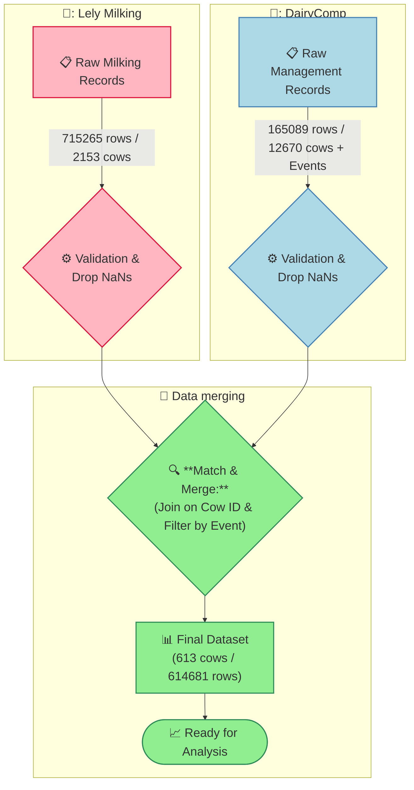

```mermaid
%%{init: {"themeVariables": {"fontSize": "23px"}}}%%

flowchart TB
    %% --- Styles ---
    %% Global font-size is set above via the init directive. Change the value
    %% in the init line ("20px") to increase/decrease font size across the diagram.
    classDef lely fill:lightpink,stroke:crimson,stroke-width:2px;
    classDef dairy fill:lightblue,stroke:steelblue,stroke-width:2px;
    classDef harmon fill:lightgreen,stroke:seagreen,stroke-width:2px;

    %% --- Stream 1: Lely Milking Data ---
    subgraph S1["🐄: Lely Milking"]
    direction TB
        %% <br/> added for separation, text simplified
        A["<br/>📋 Raw Milking Records"]:::lely -->|"715265 rows / 2153 cows"| B{"⚙️ Validation & Drop NaNs"}:::lely
    end

    %% --- Stream 2: DairyComp Management Data ---
    subgraph S2 ["📑: DairyComp"]
        direction TB
        %% Adding a bit of space at the top of the first node label
        E["<br/>📋 Raw Management Records<br/>"]:::dairy -->|"165089 rows / 12670 cows + Events"| F{"⚙️ Validation & Drop NaNs"}:::dairy
    end

    %% --- Data Harmonization & Final Steps (I and J are merged) ---
    subgraph S3["🧩 Data merging "]
    direction TB

        %% MERGED I and J into a single step for conciseness
        I{"🔍 **Match & Merge:**<br/>(Join on Cow ID & Filter by Event)"}:::harmon
        
        K["📊 Final Dataset<br/>(613 cows / 614681 rows)"]:::harmon
        
        I --> K
        K --> L(["📈 Ready for Analysis"]):::harmon
    end

    %% --- Layout Connections ---
    B --> I
    F --> I
```